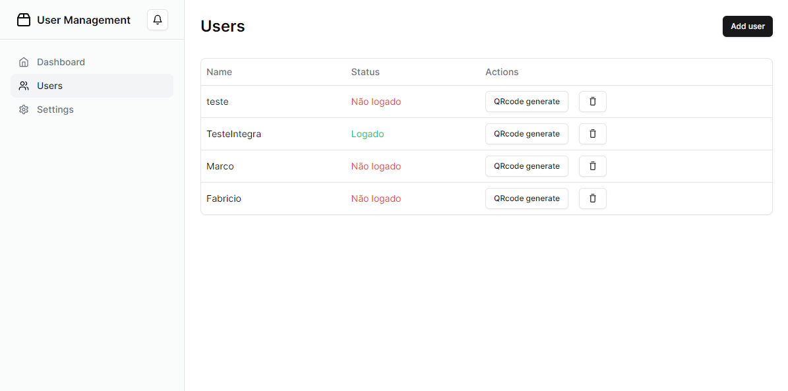
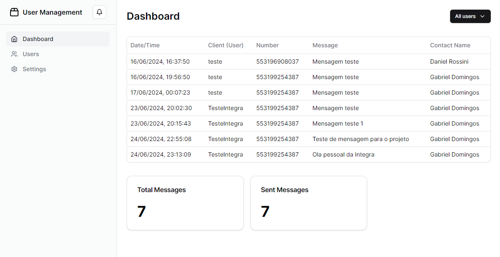
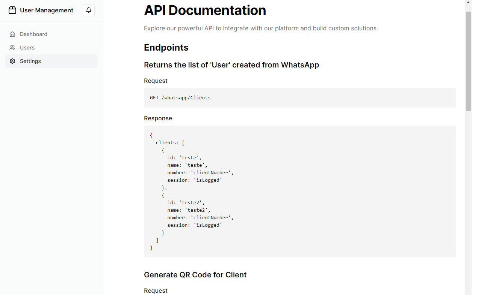

# Projeto de Integração com WhatsApp

Bem-vindo ao repositório do Projeto de Cadastro de Numeros e Envio de mensagens automatizas no WhatsApp! Este projeto oferece uma solução completa para integrar o WhatsApp com um sistema de comunicação automatizada, além de fornecer um dashboard intuitivo para monitorar e gerenciar as interações.

---

## Visão Geral

O projeto é composto por um servidor construído com Node.js e NestJS, que se integra ao WhatsApp usando a biblioteca Venom Bot. O front-end é desenvolvido em Next.js, proporcionando uma interface moderna e responsiva para os usuários.

---

## Tecnologias Utilizadas

- **Node.js**: Plataforma de desenvolvimento back-end.
- **NestJS**: Framework para Node.js utilizado na construção da API.
- **Venom Bot**: Biblioteca para integração com o WhatsApp.
- **Next.js**: Framework para desenvolvimento do front-end.
- **Prisma**: ORM utilizado para gerenciar o banco de dados.
- **SQLite**: Banco de dados utilizado no projeto.

---

## Funcionalidades

- **Dashboard**: Painel de controle intuitivo para visualização de dados.
- **Gerenciamento de Usuários**: Adição e remoção de usuários.
- **Envio de Mensagens/ Cadastro de Chats**: Integração com o WhatsApp para envio de mensagens e Cadastro de Numeros.
- **Monitoramento de Mensagens**: Visualização das mensagens enviadas. (Futuramente Recebimento de mensagens)

---

## Telas do Sistema

### Tela de Clientes (Contas Whatsapp)



### Tela Principal do Dashboard




### Tela da Documentaçção da API




## Por que deveria utilizar esse projeto?

Esse projeto foi construido no intuito de automatizar o cadastro de chats novos no Whatsapp a partir de um mailing de numeros, cadastrando um chat a partir de uma mensagem apresentando sua empresa por exemplo. Como no exemplo abaixo aonde podemos ver aonde poderiamos aplicar esse projeto:

Este script em Shell faz uma lista de 10 números de telefone e utiliza a API para cadastro.

## Script

```bash
#!/bin/bash

# Lista de números de telefone com prefixo 5531
numeros=(
    "5531999999991"
    "5531999999992"
    "5531999999993"
    "5531999999994"
    "5531999999995"
    "5531999999996"
    "5531999999997"
    "5531999999998"
    "5531999999999"
    "5531999999000"
)

# URL da API
api_url="http://localhost:3333/whatsapp/add-number"

# ID do cliente
client_id="seuClienteId"

# Mensagem a ser enviada
mensagem="Mensagem teste"

# Função para cadastrar número
cadastrar_numero() {
    local numero=$1
    response=$(curl -s -X POST "$api_url/$client_id" \
        -H "Content-Type: application/json" \
        -d '{"phoneNumber": "'$numero'", "message": "'$mensagem'"}')
    echo "Número: $numero - Resposta: $response"
}

# Iterar sobre a lista de números e cadastrar cada um
for numero in "${numeros[@]}"; do
    cadastrar_numero "$numero"
done


